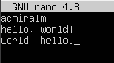

# DO1_Linux

## Part 1. Установка ОС

+ **Установка Ubuntu 20.04 Server LTS без графического интерфейса**;

+ Узнать версию Ubuntu:\
`cat /etc/issue`

+ 

## Part 2. Создание пользователя

+ Создание нового пользователя и добавление его в группу **adm**. Имя нового пользователя - *part2*. \

+ Проверка созданый пользователь *part2*! Должен находится в файле `/etc/passwd`:\
`less /etc/passwd`  

+ Проверить, что пользователь *part2* добавлен в группу **adm**!\
`groups`\
или\
`less /etc/group`

## Part 3. Настройка сети ОС

+ **Установили имя компьютера: `user-1`** \
Команда для установления имени (редактировать файлы): \
`sudo vim /etc/hostname` и `sudo vim /etc/hosts`\
Команда для проверки: \
`hostname`

+ **Установка временной зоны моего месторасположения** - ***Россия, Москва***

  + Проверка текущей временной зоны на компьютере, используем команды: `date` или `timedatectl`.

  + Если текущая временная зона не соответствует нужной, то меняем.

  + Узнать правильное значение нужной временной зоны можно командами:\
   `tzselect`\
   или\
   `timedatectl list-timezones | grep Europe | less`

  + Устанавливаем нужную временную зону:\
   `timedatectl set-timezone Europe/Moscow`

  + Проверка, Используем команды: `date` или `timedatectl`.

+ **Вывести список всех сетевых интерфейсов.**\
Есть несколько способов:

  + `ls /sys/class/net`;
  + `ip link show`;
  + `ifconfig`. Но эта команда устарела и желательно использовать команду `ip`;

  + 
  
  + Сетевой интерфейс **lo (loopback device)** – виртуальный интерфейс, присутствующий по умолчанию в любом Linux. Он используется для отладки сетевых программ и запуска серверных приложений на локальной машине. С этим интерфейсом всегда связан адрес 127.0.0.1. У него есть dns-имя – localhost. Посмотреть привязку можно в файле /etc/hosts.

+ **Получить *ip адрес* устройства, на котором мы работаем, от DHCP сервера**:\
`ip address` \

  + **DHCP** (Dynamic Host Configuration Protocol) — протокол динамической настройки узла, позволяющий устройствам автоматически получать IP-адрес, данные о DNS-сервере и другие параметры, необходимые для работы в сети.

+ **Определяем и вывводим на экран *внешний ip-адрес шлюза (ip)* и *внутренний IP-адрес шлюза*, он же ip-адрес по умолчанию (gw)**: \

  + **Внешний IP-адрес шлюза** — это IP-адрес, который используется для доступа к интернету. Этот адрес назначается интернет-провайдером и уникален для каждого устройства, подключенного к интернету.

    + Можно определить через специальные сайты (например, **ifcongig.me**), с помощью браузера, или командой: \
    `curl ifconfig.me`\
    

  + **Внутренний IP-адрес шлюза (GW)** — это IP-адрес, который назначен маршрутизатору или модему внутри локальной сети. Он используется для обмена данными между устройствами в локальной сети и внешним миром.

    + `ip route | grep default` \
    

+ **Задаём статичные (заданные вручную, а не полученные от DHCP сервера) настройки ip, gw, dns (используй публичный DNS серверы, например 1.1.1.1 или 8.8.8.8)**

  + Редактируем файл `/etc/netplan/00-installer-config.yaml`:

    + До редактирования: \
    

    + После редактирования: \
    

+ **Перезагрузили виртуальную машину. Нужно убедиться, что статичные сетевые настройки (ip, gw, dns) соответствуют заданным в предыдущем пункте.**

  + 

  + Пропинговали удаленные хосты **1.1.1.1** и **ya.ru**. В выводе команды должна быть фраза **«0% packet loss»**. \
  `ping -c 5 ya.ru`\
  Опция `-с` говорит, какое количество пакетов нужно отправить, чтобы работа утилиты остановилось. (в данном случае 5).\
  Без этого параметра, утилита будет работать пока не нажмём **Ctrl + C**.\
  

## Part 4. Обновление ОС

+ **Обновть системные пакеты до последней, на момент выполнения задания, версии.**

  + Обновить список пакетов, версия которых не соответствует последней версии.\
  `sudo apt update` \
  

  + Установить обновлённые пакеты: \
  `sudo apt upgrade`

  + Проверить, обновились ли пакеты в системе:\
  `sudo apt update` \
  

## Part 5. Использование команды sudo

+ **Разреши пользователю, созданному в [Part 2](#part-2-создание-пользователя),выполнять команду sudo.**

  + **sudo** — команда, которая наделяет правами суперпользователя. Ее используют прежде какой-либо иной команды в консоли для выполнения с правами администратора. Используется данная утилита довольно часто, особенно при обновлении и модификации пакетов ОС.

  + Имя пользователя - *part2*.\
  Чтобы пользователь мог обладать правами администратора, пользователь должен быть добавлен в группу **sudo**.\

  + Редактируем файл с группами:\
  `sudo vim /etc/group`\
  Добавляем в группу **sudo** пользователя *part2*\
  
  
  + Переключаемся на пользователя *part2*:\
  `sudo su part2`

  + Проверяем в каких группах *part2* состоит:\
  `groups`
  Должна присутствовать группа **sudo**.\
  

  + Меняем Имя компьютера от имени пользователя *part2* на **user-2-server**, редактируем файлы `/etc/hostname` и `/etc/hosts`.

  + Перезагружаем систему:\
  `reboot`

  + Проверяем:\
  `hostname`\
  

## Part 6. Установка и настройка службы времени

+ **Настройка службы автоматической синхронизации времени.**

  + **NTP** (сетевой протокол времени) - это протокол, отвечающий за синхронизацию времени компьютера со стандартными эталонными часами через интернет с помощью иерархии серверов NTP.

  + Вывести время моего часового пояса. Использую команду: `timedatectl show`\
  В выводимой информации должна быть строчка `NTPSynchronized=yes`\
  

  + Чтобы сихнронизация работала корректно, модуль **systemd-timesyncd** должен быть в статусе **активен**.\
  

## Part 7. Установка и использование текстовых редакторов

+ Установить текстовые редакторы VIM (+ любые два по желанию NANO, MCEDIT, JOE и т.д.)\

+ Буду использовать: **Vim**, **Nano** и **Emacs**.

+ Используя каждый из редакторов, создать файл **test_X.txt**, где **X** -- название редактора, в котором создан файл.\
Написать в каждом файле свой никнейм.\
Закрыть файл с сохранением изменений.

  + Текстовый редактор **Vim**, файл *test_vim.txt*:\
  `vim test_vim.txt`\
  \
  `:wq` - Сохранить и выйти из файла.

  + Текстовый редактор **Nano**, файл *test_nano.txt*:\
  `nano test_nano.txt`\
  \
  `Ctrl + X` --> `y` --> `test_nano.txt` - Сохранить и выйти из файла.

  + Текстовый редактор **Emacs**, файл *test_emacs.txt*:\
  `sudo apt install emacs`\
  `emacs test_emacs.txt`\
  \
  `Ctrl + X Ctrl + C` --> `y` - Сохранить и выйти из файла.

+ Используя каждый из трех редакторов, открыть файл на редактирование, отредактировать файл, заменив никнейм на строку **«21 School 21»**, закрыть файл без сохранения изменений.

  + **Vim**\
  `vim test_vim.txt`\
  \
  `:q!` - выйти из файла без сохранения.

  + **Nano**\
  `nano test_nano.txt`\
  \
  `Ctrl + X` --> `n` - выйти из файла без сохранения.

  + **Emacs**\
  `emacs test_emacs.txt`\
  \
  `Ctrl + X Ctrl + C` --> `n` - Сохранить и выйти из файла.

+ Используя каждый из трех редакторов, отредактировать файл ещё раз (по аналогии с предыдущим пунктом), а затем освоить функции поиска по содержимому файла (слово) и замены слова на любое другое.

  + **Vim**\
  `vim test_vim.txt`

    + 
  
    + Поиск:\
    `\` - поиск с начала файла;\
    `?` - поиск с конца файла;\
    `n` - поиск вперёд;\
    `N` - поиск назад;\
    `/world`

    + Замена *шаблона* в строке:\
    `:s/world/God`

    + Замена *шаблона* в каждой строке (только первая встреча):\
    `:%s/world/God`\
    `%` - все строки.\
    

    + Замена всех *шаблонов* в файле:\
    `:%s/world/God/g`\
    `g` - все встречи.

  + **Nano**\
  `nano test_nano.txt`

    + 

    + Поиск:\
    `Ctrl + W` - строка поиска;\
    `Alt + W` - следующий поиск по прошлома *шаблону*;

    + Замена одного *шаблона*:\
    `Ctrl + W` --> `Ctrl + R` --> `world` --> `God` --> `Y` --> `N`\
    

    + Замена всех *шаблонов*:\
    `Ctrl + W` --> `Ctrl + R` --> `world` --> `God` --> `all`

  + **Emacs**\
  `emacs test_emacs.txt`\

    + 

    + Поиск:\
    `Ctrl + s` - поиск вперёд;\
    `Ctrl + r` - поиск в обратном направлении;\

    + Замена одного *шаблона*:\
    `Alt + x query-replace` или `Alt + Shift + %` --> `y` --> `n`\
    

    + Замена всех *шаблонов*:\
    `Alt + x replace-string`

## Part 8. Установка и базовая настройка сервиса SSHD

+ **SSH (Secure Shell)** - это сетевой протокол безопасного доступа из одного компьютера к другому по сети.

+ **SSHd (Secure Shell Daemon)** - это демонический(фоновый) процесс, который отвечает за работу протокола SSH (Secure Shell) на сервере.\
SSHd обычно запускается как фоновый процесс на сервере и ожидает подключения от удаленных клиентов. Когда клиент подключается, SSHd устанавливает защищенное соединение и предоставляет удаленному пользователю доступ к командной строке сервера.\
\
В Ubuntu SSHd обычно запускается автоматически при загрузке системы и настраивается через конфигурационные файлы в директории /etc/ssh.

+ **OpenSSH (Open Secure Shell)** — набор программ (утилита), который позволяет шифровать сеансы связи в сети. При таких сеансах используется протокол SSH.

+ Проверяем установлена ли у нас сервер **ssh-client**:\
`ssh`\
Если установлен до будет какой то результет, в моём случае:\
\
Если не установлен, то:\
`sudo apt install openssh-client`

+ Проверяем установлен лиу нас **SSHd (ssh-server)**:\
`which sshd`\
 или \
`systemctl status sshd`\
\
Если не установлен, то устанавливаем:\
`sudo apt install openssh-server`

+ Добавить автостарт службы при загрузке системы.\
`sudo systemctl enable ssh`

+ Перенастроить службу SSHd на порт 2022:\
`sudo vim /etc/ssh/sshd_config`\
\
После нужно перезагрузить сервис:\
`sudo systemctl restart sshd`

+ Используя команду **ps**, показать наличие процесса **sshd**. Для этого к команде нужно подобрать ключи.\

  + `ps -ef | grep sshd`

  + 
  
  + Команда `ps -ef` в операционной системе Unix или Linux используется для вывода списка всех процессов, запущенных в системе, с дополнительной информацией о каждом процессе.\
  \
  `ps` - это команда, которая выводит список процессов.\
  `-e` - этот параметр указывает, что нужно вывести список всех процессов в системе, включая те, которые не принадлежат текущему пользователю.\
  `-f` - этот параметр включает вывод дополнительной информации о каждом процессе, включая идентификатор пользователя (UID), идентификатор группы (GID), командную строку, которая запустила процесс, и другие детали.

+ Перезагрузи систему:\
`reboot`

+ Вывод команды `netstat -tan` должен содержать **tcp 0 0 0.0.0.0:2022 0.0.0.0:* LISTEN** (если команды netstat нет, то ее нужно установить):\
  
  + `sudo apt install net-tools`

  + 

  + `netstat` - это команда, которая выводит информацию о сетевых соединениях.\
  `-t (--tcp)` - этот параметр указывает, что нужно включить информацию о TCP-соединениях.\
  `-a (--all)` - этот параметр указывает, что нужно включить информацию обо всех соединениях, включая закрытые и тайные.\
  `-n (--numeric)` - этот параметр указывает, что нужно выводить IP-адреса и порты в числовом формате, без их преобразования в доменные имена. Это может быть полезно, если вы хотите избежать DNS-запросов, которые могут замедлить процесс.

  + **Proto**: Название протокола (протокол TCP, UDP, UDPL, RAW).\
  **Recv-Q**: (очередь на прием) - это количество байтов данных, которые ожидают получения приложением-получателем через сокет.\
  **Send-Q**: (очередь на отправку) - это количество байтов данных, которые ожидают отправки через сокет.\
  **Local Address**: адрес локального компьтера и используемый номер порта.\
  **Foreign Address**: адрес и порт удаленного компьютера, с которой наша система установила соединение.\
  **State**: состояние сокета.

  + `tcp` - протокол TCP.\
  `0.0.0.0:2022` - локальный адрес и порт, на котором служба SSHd слушает входящие соединения.\
  `0.0.0.0:*` - удаленный адрес и порт (в данном случае, это символ * означает, что соединение может быть установлено с любым удаленным  адресом).\
  `LISTEN` - состояние порта, указывающее на то, что служба активно слушает входящие соединения.

## Part 9. Установка и использование утилит top, htop

+ **Установи и запусти утилиты *top* и *htop*.**

  + Проверка, установлены ли утилиты:\
  `top -v`\
  `htop -v`

  + На моём ПК утилиты установлены.\
  Но если нет, то надо установить:\
  `sudo apt install top`\
  `sudo apt install htop`

+ **top**

  + Запуск:\
  `top`

  + 

  + Команда **uptime** - это утилита, которая показывает время работы системы с момента последнего перезапуска. Она также отображает количество пользователей, которые в данный момент подключены к системе.

  + **uptime:** up 23 min \
  + **количество авторизованных пользователей:** 1 user \
  + **общая загрузка системы** (за последние 1, 5 и 15 минут)**:** load average: 0,02, 0,03, 0,13 \
  + **общее количество процессов:** Tasks: 93 total \
  + **загрузка cpu:** %Cpu(s): 1,0 us, 0,7 sy, 0,0 ni, 98,4 id, 0,0 wa, 0,0 hi, 0,0 si, 0,0 st \
  + **загрузку памяти:** MiB Mem: 1971,6 total, 1169,8 free, 139,5 used, 662,3 buff/cache \
  + **pid процесса занимающего больше всего памяти:**
    + `Shift + m` - сортировка по памяти.
    + 
    + 667
  + **pid процесса, занимающего больше всего процессорного времени:**
    + `Shift + t` - сортировка по времени.
    + 
    + 1200
  
+ **htop**

  + Запуск: \
  `htop`

  + Отсортировать по полям PID, PERCENT_CPU, PERCENT_MEM, TIME:

    + `F6` - сортировка по полю.

    + PID \
    

    + PERCENT_CPU \
    

    + PERCENT_MEM \
    

    + TIME \
    

  + Отфильтровать для вывода процесса **sshd**: \

    + `F4` - фильтр.
    + 

  + Используя поиск, найти процесс **syslog**:\

    + `F3` - поиск.
    + 

  + C добавленным выводом **hostname**, **clock** и **uptime**

    + `F2` - Настройки (setup)
    + 

## Part 10. Использование утилиты fdisk

+ Запусти команду `fdisk -l`.\
`sudo fdisk -l`

  + `fdisk` - это утилита для работы с разделами диска.
  + `-l` - этот параметр указывает, что нужно вывести список всех разделов на всех подключенных дисках.
  + 

  + Название жесткого диска: /dev/sda
  + Размер: 25 GiB
  + Количество секторов: 52428800
  + Размер swap: 2 G\
  `swapon --show`

## Part 11. Использование утилиты df

+ **df** - это команда для получения подробного отчета об использовании дискового пространства системы.

+ Запусти команду **df**.\
  `df /`\
  

  + **размер раздела:** 11758760
  + **размер занятого пространства:** 5249540
  + **размер свободного пространства:** 5890112
  + **процент использования:** 48%
  + **единица измерения в выводе:** Килобайты

  + Запусти команду **df -Th**.\
  `df -Th /` \
  

    + `-T` - выводит тип файловой системы.
    + `-h` - человекочитаемый вид.

    + **размер раздела:** 12 G
    + **размер занятого пространства:** 5,1 G
    + **размер свободного пространства:** 5,7 G
    + **процент использования:** 48%
    + **тип файловой системы для раздела:** ext4

## Part 12. Использование утилиты du

+ **du** - это команда для получения приблизительного объема дискового пространства, используемого указанными при вызове команды файлами или каталогами.

+ Запустить `du`:\
`sudo du`

+ Вывеcти размер папок **/home, /var, /var/log**.

  + В байтах: \
  `sudo du -s /home` \
  `sudo du -s /var` \
  `sudo du -s /var/log` \
  

  + В человекочитаемой форме: \
  `sudo du -sh /home` \
  `sudo du -sh /var` \
  `sudo du -sh /var/log` \
  

+ Вывести размер всего содержимого в **/var/log** (не общее, а каждого вложенного элемента, используя *) \
`sudo du -sh /var/log/*` \

## Part 13. Установка и использование утилиты ncdu

+ **ncdu** - это команда, имеющая то же назначение, что и du, но обладающая приятным и удобным интерфейсом.

+ Установить утилиту **ncdu**: \
`sudo apt install ncdu`

+ Вывести размер папок **/home, /var, /var/log**

  + `ncdu -x /`
  + 
  + 

## Part 14. Работа с системными журналами

+ **Открой для просмотра:**
  + /var/log/dmesg
  + /var/log/syslog
  + /var/log/auth.log

+ Буду использовать команда `less` для открытия в режиме прокрутки.

+ По файлу **/var/log/auth.log** смотрим время последней успешной авторизации, имя пользователя и метод входа в систему:

  + `cat /var/log/auth.log | grep login` \
  

  + **время последней успешной авторизации:** 20:56:48
  + **имя пользователя:** admiralm
  + **метод входа в систему:** by LOGIN(uid=0)

+ **Перезапусти службу SSHd:** \
`sudo systemctl restart ssh`

  + `less /var/log/syslog` \
  

## Part 15. Использование планировщика заданий CRON

+ **CRON** - это программа-демон. Её основная задача выполнять указанные пользователем процессы в указанное пользователем время, например с определённой периодичностью.

+ Используя планировщик заданий, запускать команду **uptime** через каждые 2 минуты.

  + `crontab -e` \
  Команда создаст файл, куда мы внесём запись: \
  `*/2 * * * * uptime`

  + Найти в системных журналах строчки (минимум две в заданном временном диапазоне) о выполнении: \
  `cat /var/log/syslog | grep uptime` \
  

  + Вывести на экран список текущих заданий для CRON: \
  `crontab -l` \
   

+ Удалить все задания из планировщика заданий: \
`crontab -r` \

